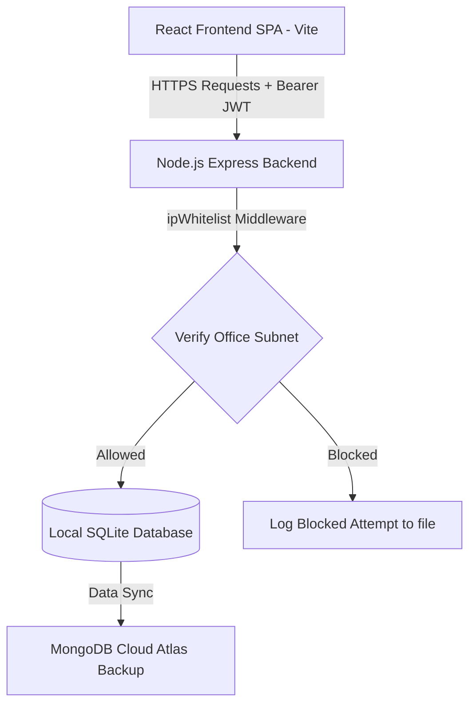
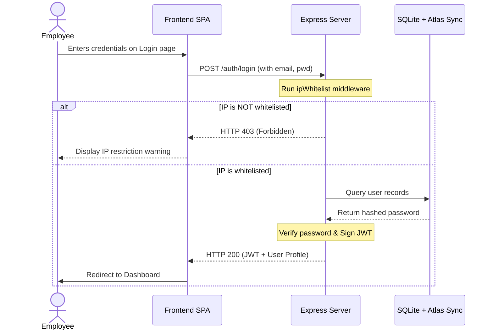

# CEGS HRMS - Comprehensive System Documentation

This document serves as the official Software Requirements Specification (SRS) and System Design Document (SDD) for the **CEGS Human Resource Management System (HRMS)**. It outlines the system requirements, architectural structure, technical specifications, and security policies governing the CEGS HRMS codebase.

---

## Table of Contents
1. [Introduction](#1-introduction)
2. [Project Overview](#2-project-overview)
3. [Objectives](#3-objectives)
4. [Scope](#4-scope)
5. [Business Requirements](#5-business-requirements)
6. [Functional Requirements](#6-functional-requirements)
7. [Non-Functional Requirements](#7-non-functional-requirements)
8. [System Architecture](#8-system-architecture)
9. [Technology Stack](#9-technology-stack)
10. [Database Design](#10-database-design)
11. [API Documentation](#11-api-documentation)
12. [Module Description](#12-module-description)
13. [UI Screens](#13-ui-screens)
14. [User Flow](#14-user-flow)
15. [Security](#15-security)
16. [Testing](#16-testing)
17. [Deployment](#17-deployment)
18. [Risks](#18-risks)
19. [Future Enhancements](#19-future-enhancements)
20. [Conclusion](#20-conclusion)

---

## 1. Introduction

### 1.1 Purpose
This document provides a detailed overview of the Center for Electronic Governance Systems (CEGS) Human Resource Management System (HRMS). It serves as a technical blueprint for developers, administrators, database operators, and security auditors who maintain, upgrade, or deploy the application.

### 1.2 Intended Audience
- **System Administrators**: For deploying and configuring servers, environment settings, and access white-lists.
- **Developers**: For extending features on either the React frontend SPA or the Express backend REST API.
- **Database Administrators**: For understanding SQLite tables, fields, constraints, and the hybrid MongoDB backup synchronization cycle.
- **Security Officers**: For auditing the IP-based whitelisting mechanisms, roles, permissions model, and JWT sessions.

---

## 2. Project Overview

The CEGS HRMS is an enterprise-grade web application designed to manage internal organizational structures, employee lifecycle records, timesheets, assets, expenses, document generation, and onboarding progress. It incorporates robust network security protocols, restricting access to authorized office environments to safeguard critical employee and enterprise resource records.

---

## 3. Objectives

- **Security Enforcement**: Protect HR databases by restricting system access to whitelisted office networks (WiFi and LAN subnets).
- **Process Automation**: Automate payroll processing, leave requests, timesheet logs, and expense reports to eliminate manual error.
- **Centralization**: Provide a single repository for department records, employee files, onboarding tasks, company announcements, and digital templates.
- **Compliance & Transparency**: Generate instant audit trails for compliance validation and configure custom role-based permissions dynamically.

---

## 4. Scope

### 4.1 In Scope
- Single Page Application (SPA) frontend with role-specific views.
- 15 relational tables managing departments, users, leaves, attendance (geocoded), payroll, timesheets, assets, expenses, and document flows.
- IP-whitelisting check in login middleware (IPv4 and IPv6-mapped IPv4 supported).
- Cloud backup integration syncing local SQLite databases to MongoDB Atlas.
- Multer-driven document and expense receipt uploading.
- Custom template compilation for automated document generation.

### 4.2 Out of Scope
- Direct banking API gateways for executing financial payouts (the system computes payroll, but disbursement occurs externally).
- External physical biometric card reader synchronization (attendance check-ins are logged through the web client with geocoordinates).
- Native iOS or Android mobile applications (the app uses a mobile-responsive web layout).

---

## 5. Business Requirements

### 5.1 Access Control Constraints
An employee must connect to the office WiFi or local office LAN to authenticate. Blocked logins log the client's IP and timestamp in `blocked_attempts.log` and return an HTTP 403 Forbidden status.

### 5.2 Roles Hierarchy
1. **Super Admin**: Full power. Admin status toggling, role editing, custom permission mapping in JSON, system parameter settings modification, and log auditing.
2. **HR Admin (Admin)**: Full operational control. Employees and departments management, leaves approval, timesheets review, expenses check, assets dispatch, and document/onboarding generation.
3. **Employee**: Self-service access. Personal profile dashboard, geolocation check-in/out, leave application, timesheet logging, expense claims submission, and document requests.

---

## 6. Functional Requirements

### 6.1 Authentication & Network Access
- Client IP lookup during credential validation.
- Standard email/password verification using bcrypt password hashes.
- JWT-based authentication tokens signed with a 24-hour expiration time.
- Forgot-password temporary resets (`Password123` fallback configuration for local testing).

### 6.2 Employees & Departments Management
- Creation and modification of employee files (salary, designated manager, joining date, status, emergency/bank info).
- Department hierarchy management with manager assignments and budget constraints.

### 6.3 Leave & Timesheet Tracking
- Multi-category leave application (Sick, Casual, Annual, unpaid) with collision-preventing calendar dates.
- Manager dashboard for viewing, approving, or rejecting leave with reasoning.
- Daily project timesheet logs (start/end times, durations, descriptions) with approval flows.

### 6.4 Geolocation-verified Attendance
- Record daily check-in and check-out events.
- Geolocation tracking recording latitude, longitude, and verification flags indicating office bounds.
- System automatic calculations of daily work hours.

### 6.5 Financials (Payroll & Expenses)
- Monthly payroll sheet generation with allowances, overtime bonuses, tax/other deductions, and draft/processed states.
- Multi-category expense claiming with receipt file uploads and approval routes.

### 6.6 Documents & Onboarding
- Text template compiler generating personalized contracts, letters, and certificates.
- Multi-step onboarding workflow for new hires mapping position-based tasks.

---

## 7. Non-Functional Requirements

- **Security**: Double-layered auth check: Network IP Whitelist + JWT validation. Password salting (10 rounds bcrypt).
- **Availability**: System maintains SQLite local read-write speeds, syncing back to MongoDB Atlas so the local SQLite state is dynamically backed up.
- **Usability**: Modern look and feel featuring Lucide Icon packs, interactive badges, loading frames, and transitions.
- **Scalability**: Decoupled Client-Server API layout allowing Vercel deployment with serverless routing.

---

## 8. System Architecture



The system employs a Client-Server architecture. The frontend React single-page application calls REST API endpoints exposed by the Node.js Express server. Data is stored locally in an SQLite file for extreme low latency, which is synced to MongoDB Atlas after every database mutation.

---

## 9. Technology Stack

### 9.1 Frontend
- **Framework**: React.js (v18.3.1)
- **Bundler**: Vite (v5.2.11)
- **Styling**: Vanilla CSS (including dashboard layouts, modals, and tables)
- **Icons**: Lucide React

### 9.2 Backend & Database
- **Runtime**: Node.js (v20+)
- **API Framework**: Express (v4.19.2)
- **Cryptography**: bcryptjs (v2.4.3), jsonwebtoken (v9.0.2)
- **Local Engine**: sqlite3 (v5.1.7)
- **Cloud Backup**: mongodb driver (v7.5.0)
- **File Uploads**: multer (v1.4.5)

---

## 10. Database Design

The application utilizes 15 tables in its SQLite database schema:

```
+---------------------+      +---------------------+      +---------------------+
|     departments     |      |        users        |      |       leaves        |
+---------------------+      +---------------------+      +---------------------+
| id (PK)             |      | id (PK)             |      | id (PK)             |
| name (UNIQUE)       |      | employee_id (UNIQUE)|      | user_id (FK)        |
| code (UNIQUE)       | <--- | name, email (UNIQUE)| <--- | leave_type, reason  |
| manager_id          |      | password_hash, role |      | start_date, end_date|
| budget              |      | department_id (FK)  |      | status, applied_date|
+---------------------+      | reports_to (FK)     |      | approved_by (FK)    |
                             | designation, contact|      | rejection_reason    |
                             | basic_salary, status|      +---------------------+
                             | bank & emergency data|
                             +---------------------+
```

### 10.1 Schema Definitions

1. **`departments`**:
   - `id`: INTEGER PRIMARY KEY AUTOINCREMENT
   - `name`: TEXT UNIQUE NOT NULL
   - `code`: TEXT UNIQUE NOT NULL
   - `manager_id`: INTEGER
   - `budget`: REAL DEFAULT 0

2. **`users`**:
   - `id`: INTEGER PRIMARY KEY AUTOINCREMENT
   - `employee_id`: TEXT UNIQUE NOT NULL
   - `name`: TEXT NOT NULL
   - `email`: TEXT UNIQUE NOT NULL
   - `password_hash`: TEXT NOT NULL
   - `role`: TEXT CHECK(role IN ('employee', 'admin', 'super_admin')) NOT NULL
   - `department_id`: INTEGER, FOREIGN KEY REFERENCES `departments(id)`
   - `reports_to`: INTEGER, FOREIGN KEY REFERENCES `users(id)`
   - `designation`: TEXT
   - `joining_date`: TEXT
   - `contact`: TEXT
   - `status`: TEXT CHECK(status IN ('active', 'inactive', 'on_leave')) DEFAULT 'active'
   - `basic_salary`: REAL DEFAULT 3000
   - `avatar_url`: TEXT
   - `last_login`: TEXT
   - `emergency_contact`: TEXT
   - `bank_name`: TEXT
   - `account_number`: TEXT
   - `ifsc_code`: TEXT

3. **`leaves`**:
   - `id`: INTEGER PRIMARY KEY AUTOINCREMENT
   - `user_id`: INTEGER NOT NULL, FOREIGN KEY REFERENCES `users(id)`
   - `leave_type`: TEXT NOT NULL
   - `start_date`: TEXT NOT NULL
   - `end_date`: TEXT NOT NULL
   - `reason`: TEXT
   - `status`: TEXT CHECK(status IN ('pending', 'approved', 'rejected')) DEFAULT 'pending'
   - `applied_date`: TEXT NOT NULL
   - `approved_by`: INTEGER, FOREIGN KEY REFERENCES `users(id)`
   - `rejection_reason`: TEXT

4. **`attendance`**:
   - `id`: INTEGER PRIMARY KEY AUTOINCREMENT
   - `user_id`: INTEGER NOT NULL, FOREIGN KEY REFERENCES `users(id)`
   - `date`: TEXT NOT NULL
   - `check_in_time`: TEXT
   - `check_out_time`: TEXT
   - `check_in_lat`: REAL
   - `check_in_lng`: REAL
   - `status`: TEXT CHECK(status IN ('present', 'late', 'absent')) DEFAULT 'present'
   - `location_verified`: INTEGER DEFAULT 0
   - `work_hours`: REAL DEFAULT 0
   - *Constraint*: UNIQUE(user_id, date)

5. **`payroll`**:
   - `id`: INTEGER PRIMARY KEY AUTOINCREMENT
   - `user_id`: INTEGER NOT NULL, FOREIGN KEY REFERENCES `users(id)`
   - `month`: INTEGER NOT NULL
   - `year`: INTEGER NOT NULL
   - `basic_salary`: REAL NOT NULL
   - `allowances`: REAL DEFAULT 0
   - `overtime`: REAL DEFAULT 0
   - `bonus`: REAL DEFAULT 0
   - `deductions`: REAL DEFAULT 0
   - `net_salary`: REAL NOT NULL
   - `status`: TEXT CHECK(status IN ('processed', 'draft')) DEFAULT 'draft'
   - `processed_date`: TEXT
   - *Constraint*: UNIQUE(user_id, month, year)

6. **`timesheets`**:
   - `id`: INTEGER PRIMARY KEY AUTOINCREMENT
   - `user_id`: INTEGER NOT NULL, FOREIGN KEY REFERENCES `users(id)`
   - `date`: TEXT NOT NULL
   - `start_time`: TEXT
   - `end_time`: TEXT
   - `duration`: REAL DEFAULT 0
   - `project`: TEXT NOT NULL
   - `task`: TEXT NOT NULL
   - `status`: TEXT CHECK(status IN ('pending', 'approved', 'rejected')) DEFAULT 'pending'
   - `approved_by`: INTEGER, FOREIGN KEY REFERENCES `users(id)`

7. **`assets`**:
   - `id`: INTEGER PRIMARY KEY AUTOINCREMENT
   - `asset_name`: TEXT NOT NULL
   - `serial_number`: TEXT UNIQUE NOT NULL
   - `category`: TEXT NOT NULL
   - `status`: TEXT CHECK(status IN ('available', 'assigned', 'maintenance')) DEFAULT 'available'
   - `assigned_to`: INTEGER, FOREIGN KEY REFERENCES `users(id)`
   - `condition`: TEXT
   - `location`: TEXT
   - `date_added`: TEXT

8. **`expenses`**:
   - `id`: INTEGER PRIMARY KEY AUTOINCREMENT
   - `user_id`: INTEGER NOT NULL, FOREIGN KEY REFERENCES `users(id)`
   - `title`: TEXT NOT NULL
   - `category`: TEXT NOT NULL
   - `amount`: REAL NOT NULL
   - `date`: TEXT NOT NULL
   - `receipt_url`: TEXT
   - `status`: TEXT CHECK(status IN ('pending', 'approved', 'rejected')) DEFAULT 'pending'
   - `approved_by`: INTEGER, FOREIGN KEY REFERENCES `users(id)`

9. **`documents`**:
   - `id`: INTEGER PRIMARY KEY AUTOINCREMENT
   - `user_id`: INTEGER NOT NULL, FOREIGN KEY REFERENCES `users(id)`
   - `title`: TEXT NOT NULL
   - `document_type`: TEXT NOT NULL
   - `template_name`: TEXT
   - `file_path`: TEXT
   - `status`: TEXT CHECK(status IN ('generated', 'sent', 'signed', 'completed')) DEFAULT 'generated'
   - `created_at`: TEXT NOT NULL

10. **`document_templates`**:
    - `id`: INTEGER PRIMARY KEY AUTOINCREMENT
    - `name`: TEXT UNIQUE NOT NULL
    - `subject`: TEXT NOT NULL
    - `body_template`: TEXT NOT NULL

11. **`onboarding_hires`**:
    - `id`: INTEGER PRIMARY KEY AUTOINCREMENT
    - `user_id`: INTEGER NOT NULL, FOREIGN KEY REFERENCES `users(id)`
    - `position`: TEXT NOT NULL
    - `start_date`: TEXT NOT NULL
    - `progress_percent`: INTEGER DEFAULT 0
    - `status`: TEXT CHECK(status IN ('in_progress', 'completed')) DEFAULT 'in_progress'

12. **`onboarding_tasks`**:
    - `id`: INTEGER PRIMARY KEY AUTOINCREMENT
    - `hire_id`: INTEGER NOT NULL, FOREIGN KEY REFERENCES `onboarding_hires(id)`
    - `task_name`: TEXT NOT NULL
    - `is_completed`: INTEGER CHECK(is_completed IN (0, 1)) DEFAULT 0
    - `role_specific`: TEXT NOT NULL

13. **`notifications`**:
    - `id`: INTEGER PRIMARY KEY AUTOINCREMENT
    - `sender_id`: INTEGER, FOREIGN KEY REFERENCES `users(id)`
    - `recipient_id`: INTEGER, FOREIGN KEY REFERENCES `users(id)`
    - `department_id`: INTEGER, FOREIGN KEY REFERENCES `departments(id)`
    - `title`: TEXT NOT NULL
    - `message`: TEXT NOT NULL
    - `is_read`: INTEGER CHECK(is_read IN (0, 1)) DEFAULT 0
    - `created_at`: TEXT NOT NULL

14. **`roles_permissions`**:
    - `id`: INTEGER PRIMARY KEY AUTOINCREMENT
    - `role_name`: TEXT UNIQUE NOT NULL
    - `permissions_json`: TEXT NOT NULL

15. **`system_settings`**:
    - `key`: TEXT PRIMARY KEY
    - `value`: TEXT NOT NULL

---

## 11. API Documentation

All administrative and operational endpoints (except check-ip and login) require a header parameter `Authorization: Bearer <JWT_TOKEN>`.

### 11.1 Authentication & Authorization (`/auth`)
| Method | Route | Description | Payload Example | Expected Response |
| :--- | :--- | :--- | :--- | :--- |
| **GET** | `/auth/check-ip` | Verifies client IP whitelist state | None | `{ "allowed": true }` |
| **POST** | `/auth/login` | Authenticates user (salts checked) | `{ "email": "nusrath@cegs.com", "password": "..." }` | `{ "token": "...", "user": { ... } }` |
| **GET** | `/auth/session` | Resolves session token validation | None | `{ "user": { "id": 1, ... } }` |
| **POST** | `/auth/forgot-password` | Resets password temporarily for local testing | `{ "email": "employee@cegs.com" }` | `{ "message": "Password reset successful! ..." }` |

### 11.2 Departments (`/api/departments`)
| Method | Route | Description | Payload Example | Expected Response |
| :--- | :--- | :--- | :--- | :--- |
| **GET** | `/api/departments` | Returns list of all departments | None | `[{ "id": 1, "name": "IT", ... }]` |
| **POST** | `/api/departments` | Creates a new department (Admin only) | `{ "name": "R&D", "code": "RD", ... }` | `{ "id": 4, "name": "R&D" }` |
| **PUT** | `/api/departments/:id` | Modifies department parameters (Admin only) | `{ "manager_id": 2, "budget": 80000 }` | `{ "changes": 1 }` |
| **DELETE** | `/api/departments/:id` | Removes a department (Admin only) | None | `{ "message": "Department deleted" }` |

### 11.3 Employees (`/api/employees`)
| Method | Route | Description | Payload Example | Expected Response |
| :--- | :--- | :--- | :--- | :--- |
| **GET** | `/api/employees` | Lists all profiles | None | `[{ "id": 1, "name": "Madiha", ... }]` |
| **GET** | `/api/employees/:id` | Fetch specific employee details | None | `{ "id": 1, "name": "Madiha", ... }` |
| **POST** | `/api/employees` | Registers new user record (Admin only) | `{ "name": "John", "email": "john@cegs.com", ... }` | `{ "id": 10, "employee_id": "EMP-010" }` |
| **PUT** | `/api/employees/:id` | Updates user details | `{ "contact": "9999999999" }` | `{ "changes": 1 }` |
| **DELETE** | `/api/employees/:id` | Deactivates/removes user record (Admin only) | None | `{ "message": "Employee deleted" }` |

### 11.4 Leaves & Attendance (`/api`)
| Method | Route | Description | Payload Example | Expected Response |
| :--- | :--- | :--- | :--- | :--- |
| **GET** | `/api/leaves` | Retrieve leave list matching user permissions | None | `[{ "id": 2, "leave_type": "Sick", ... }]` |
| **POST** | `/api/leaves` | Submits a new leave request | `{ "leave_type": "Casual", "start_date": "...", ... }` | `{ "id": 5 }` |
| **PUT** | `/api/leaves/:id/status` | Approve or reject a leave request (Admin only) | `{ "status": "approved", "rejection_reason": "" }` | `{ "changes": 1 }` |
| **GET** | `/api/attendance` | Fetch attendance records | None | `[{ "date": "2026-07-24", "status": "present", ... }]` |
| **POST** | `/api/attendance/check-in` | Record daily check-in with coordinates | `{ "lat": 17.3850, "lng": 78.4867 }` | `{ "id": 42, "status": "present", ... }` |
| **POST** | `/api/attendance/check-out` | Record check-out and computes work duration | None | `{ "work_hours": 8.5 }` |

### 11.5 Payroll & Timesheets (`/api`)
| Method | Route | Description | Payload Example | Expected Response |
| :--- | :--- | :--- | :--- | :--- |
| **GET** | `/api/payroll` | Fetch month/year payroll | None | `[{ "user_id": 1, "net_salary": 4500 }]` |
| **POST** | `/api/payroll/process` | Processes monthly records (Admin only) | `{ "month": 7, "year": 2026 }` | `{ "message": "Payroll processed successfully" }` |
| **GET** | `/api/timesheets` | Lists timesheet items | None | `[{ "id": 1, "project": "HRMS", "task": "..." }]` |
| **POST** | `/api/timesheets` | Logs a new task sheet | `{ "date": "2026-07-24", "project": "HRMS", ... }` | `{ "id": 15 }` |
| **PUT** | `/api/timesheets/:id/status` | Review and approve/reject timesheets (Admin only) | `{ "status": "approved" }` | `{ "changes": 1 }` |

### 11.6 Assets & Expenses (`/api`)
| Method | Route | Description | Payload Example | Expected Response |
| :--- | :--- | :--- | :--- | :--- |
| **GET** | `/api/assets` | View system assets allocation | None | `[{ "id": 1, "asset_name": "Laptop", ... }]` |
| **POST** | `/api/assets` | Register a new asset (Admin only) | `{ "asset_name": "Keyboard", "serial_number": "..." }` | `{ "id": 7 }` |
| **PUT** | `/api/assets/:id` | Modify asset ownership or status (Admin only) | `{ "status": "assigned", "assigned_to": 1 }` | `{ "changes": 1 }` |
| **DELETE** | `/api/assets/:id` | Remove asset item (Admin only) | None | `{ "message": "Asset deleted" }` |
| **GET** | `/api/expenses` | List expense records | None | `[{ "id": 1, "title": "Internet", "amount": 50 }]` |
| **POST** | `/api/expenses` | Claim a new expense | `{ "title": "Client dinner", "amount": 120, ... }` | `{ "id": 10 }` |
| **PUT** | `/api/expenses/:id/status` | Process expense approval status (Admin only) | `{ "status": "approved" }` | `{ "changes": 1 }` |

### 11.7 Digital Documents & Onboarding (`/api`)
| Method | Route | Description | Payload Example | Expected Response |
| :--- | :--- | :--- | :--- | :--- |
| **GET** | `/api/documents` | Retrieve generated letters and contracts | None | `[{ "id": 1, "title": "Offer Letter", ... }]` |
| **GET** | `/api/documents/templates` | Retrieve document templates list | None | `[{ "id": 1, "name": "offer_letter", ... }]` |
| **POST** | `/api/documents/templates` | Create a new document template (Admin only) | `{ "name": "relieving_letter", "body_template": "..." }` | `{ "id": 3 }` |
| **POST** | `/api/documents/request` | Submit a request for letter generation | `{ "document_type": "Experience Letter" }` | `{ "id": 9 }` |
| **POST** | `/api/documents/generate` | Generate PDF/Text contract dynamically (Admin only) | `{ "user_id": 1, "template_name": "Offer Letter" }` | `{ "id": 8, "status": "generated" }` |
| **GET** | `/api/onboarding` | Fetch hiring lists and onboarding logs (Admin only) | None | `[{ "user_id": 2, "progress_percent": 30 }]` |
| **POST** | `/api/onboarding` | Initiates onboarding flow for a user (Admin only) | `{ "user_id": 2, "position": "Developer", ... }` | `{ "id": 4 }` |
| **PUT** | `/api/onboarding/tasks/:id` | Mark onboarding subtask status (0 or 1) | `{ "is_completed": 1 }` | `{ "changes": 1 }` |

### 11.8 Notifications & System Admin Settings (`/api`)
| Method | Route | Description | Payload Example | Expected Response |
| :--- | :--- | :--- | :--- | :--- |
| **GET** | `/api/notifications` | View system alerts and personal notifications | None | `[{ "id": 1, "title": "Meeting", ... }]` |
| **POST** | `/api/notifications/read` | Mark all user alerts read | None | `{ "message": "Notifications read" }` |
| **DELETE** | `/api/notifications/clear` | Clear notification inbox | None | `{ "message": "Notifications cleared" }` |
| **POST** | `/api/notifications/broadcast` | Issue a global notice (Admin only) | `{ "title": "System Update", "message": "..." }` | `{ "message": "Broadcast sent" }` |
| **GET** | `/api/admin/users` | List super-admin console users (Super Admin only) | None | `[{ "id": 1, "role": "admin", ... }]` |
| **PUT** | `/api/admin/users/:id/role` | Update user roles (Super Admin only) | `{ "role": "admin" }` | `{ "changes": 1 }` |
| **PUT** | `/api/admin/users/:id/status` | Update user active statuses (Super Admin only) | `{ "status": "inactive" }` | `{ "changes": 1 }` |
| **GET** | `/api/admin/roles-permissions` | Get custom permission JSON matrix (Super Admin only) | None | `[{ "role_name": "employee", ... }]` |
| **PUT** | `/api/admin/roles-permissions/:role`| Change permissions matrix (Super Admin only) | `{ "permissions_json": "..." }` | `{ "changes": 1 }` |
| **GET** | `/api/settings` | Retrieve global system setting map | None | `{ "company_name": "CEGS", ... }` |
| **POST** | `/api/settings` | Save system setting overrides (Super Admin only) | `{ "key": "office_hours", "value": "9" }` | `{ "message": "Setting saved" }` |
| **GET** | `/api/analytics/overview` | Fetch system metrics (Admin only) | None | `{ "employees_count": 12, "expenses_sum": 5000 }` |

---

## 12. Module Description

### 12.1 Whitelist Verification Engine
This module contains the network protection logic. Located in `server/middleware/ipWhitelist.js`, it performs two primary calculations:
1. **IP Conversion**: Converts the standard dot-decimal IPv4 representation to a 32-bit integer.
   $$\text{IP\_Int} = (d_1 \times 256^3) + (d_2 \times 256^2) + (d_3 \times 256^1) + (d_4)$$
2. **Subnet Bitwise Matching**: Evaluates if the IP integer matches the base subnet network boundary derived from the CIDR mask.
   $$\text{Network\_Boundary} = \text{Subnet\_Int} \;\&\; \text{Mask\_Bits}$$
   This ensures that no external VPN-less connections can execute database writes on authentication paths.

### 12.2 Database Synchronizer
The local server contains a synchronization routine (`syncToMongo` in `server/db.js`). Since serverless hosting operates on ephemeral disk storage (which discards SQLite modifications on container shutdown), the database synchronizer reads the `database.sqlite` file binary directly after each mutation (`dbQuery.run` or `dbQuery.exec`) and commits it as a raw buffer document directly to MongoDB Atlas. During initial application spin-up, the binary is pulled from Atlas and re-written locally to the local `/tmp` path, combining SQLite's speed with Mongo's remote persistence.

### 12.3 React SPA Controller
All page routers and templates are compiled inside a single react build `client/src/App.jsx`. It coordinates:
- Local token validation from `localStorage`.
- Role check-filtering rendering only the navbar options mapped to the user credentials.
- Dropdown states, modals for creation/edit processes, state variables caching database contents, and asynchronous fetch dispatches for live-sync.

---

## 13. UI Screens

The frontend SPA contains several prominent sections:
1. **Login Portal**: Centered modal with email, password inputs, reset request routes, and floating errors explaining IP restrictions.
2. **Collapsible Navigation Bar**: Displays user details, avatar, and lists accessible views based on permissions.
3. **Analytics Dashboard**: Dashboard charts tracking active headcount, attendance status, pending approvals, and budget burn-rates.
4. **Employee Directory**: Grid profiles showing designated roles, department metadata, and direct email links.
5. **Leave Center**: Form containing calendar selections and leave type drop-downs, positioned adjacent to history cards.
6. **Attendance Console**: Time clock displaying coordinates alongside location status flags (Office Zone vs Out of Zone).
7. **Asset Register**: IT hardware logs recording conditions, category filters, and assigned personnel.
8. **Digital Document Portal**: Generates dynamic letters using text templates.
9. **Super-Admin settings console**: Custom JSON editor adjusting permissions.

---

## 14. User Flow



### 14.1 Employee Work Flow
1. Employee initiates connection to office network.
2. Logs in to dashboard via credentials.
3. Clicks "Check-In" on attendance block to verify location.
4. Completes daily tasks and logs items in the "Timesheets" panel.
5. Claims business expenditures in the "Expenses" pane by uploading receipts.
6. Submits "Check-Out" at completion of shift.

### 14.2 HR Admin Management Flow
1. HR Admin logs in to overview.
2. Navigates to "Leave Requests" to approve/deny pending claims.
3. Assigns hardware assets or updates conditions in the "Assets" portal.
4. Accesses "Onboarding" to progress task lists for new hires.
5. Runs payroll processes for current months.

---

## 15. Security

- **Network-Based Firewalling**: Middleware checks the client's incoming IP (`x-forwarded-for` or remote connection) against configurable environment variables (`ALLOWED_IP_RANGES`).
- **Session Tokens**: JWT keys are signed securely with high entropy tokens, persisting only for 24 hours.
- **Password Salting**: Passwords are saved as unidirectional hashes using 10-round bcrypt cryptography.
- **SQL Injection Safeguards**: Parameterized SQLite placeholders (`SELECT ... WHERE email = ?`) ensure raw user inputs never run directly as executable SQL statements.
- **Input Sanitization**: File uploads restricted via `multer` filters to block script executables.

---

## 16. Testing

The codebase includes an automated unit test suite specifically testing the whitelist middleware algorithm:
- **Test File Path**: `server/tests/ipWhitelist.test.js`
- **Execution Script**: `npm test`

```
=================================================
Running IP Whitelist CIDR Matching Unit Tests...
=================================================
✔ Test 1: ipToInt utility parsed IPs successfully
✔ Test 2: Office WiFi IPs (10.30.0.0/20) allowed correctly
✔ Test 3: Office LAN IPs (192.168.32.0/22) allowed correctly
✔ Test 4: Network and broadcast boundary edge cases handled correctly
✔ Test 5: IPs outside whitelist ranges blocked successfully
=================================================
✔ ALL UNIT TESTS PASSED SUCCESSFULLY!
=================================================
```

---

## 17. Deployment

### 17.1 Local Host Deployment (Scenario A)
1. Navigate to the server root: `cd server`
2. Update the environment configuration file `server/.env`:
   ```env
   ALLOWED_IP_RANGES=10.30.0.0/20,192.168.32.0/22
   TRUST_PROXY=false
   JWT_SECRET=your_jwt_secret_key
   ```
3. Run migrations and seed data: `npm run seed`
4. Spin up the backend API node: `npm start`
5. Navigate to the client directory and run the frontend Vite dev server:
   ```bash
   cd ../client
   npm install
   npm run dev
   ```

### 17.2 Cloud Serverless Deployment (Scenario B)
1. Add environmental parameters directly in the host portal (Vercel, AWS, etc.):
   - `MONGODB_URI`: Remote connection URL to Atlas database cluster.
   - `TRUST_PROXY`: Set to `true` to allow the whitelist parser to inspect CDN header values.
   - `ALLOWED_IP_RANGES`: Set to the company gateway IP (e.g. `203.0.113.50`).
2. Deploy using `vercel.json` routing specifications. The Express handler will dynamically route API connections under `/api/*` and `/auth/*`.

---

## 18. Risks

1. **Ephemerality of Serverless Disk States**: If the MongoDB cloud sync fails or encounters latency, server updates written to local SQLite files in `/tmp` could be discarded on server spin-down.
2. **Proxy Header Spoofing**: If `TRUST_PROXY` is set to `true` without a designated reverse proxy configuration, attackers could spoof `x-forwarded-for` headers to bypass IP validation.
3. **Database Concurrency Lockout**: SQLite locks write operations to the database file during updates, which may cause latency under high parallel employee access spikes.

---

## 19. Future Enhancements

- **Direct DBMS Migrations**: Migrate SQLite schemas directly to PostgreSQL/MongoDB to bypass cloud synchronization routines entirely.
- **WebSocket/SSE Protocol Integrations**: Establish real-time notifications rather than relying on HTTP poll routes.
- **Third-Party Maps API Integrations**: Display check-in coordinates on visual maps inside the HR dashboard.
- **Multi-Factor Authentication (MFA)**: Support TOTP codes for logins alongside IP restrictions.

---

## 20. Conclusion

The **CEGS HRMS** serves as a robust administrative engine, combining essential HR flows with stringent security controls. By leveraging localized SQLite speeds paired with cloud Atlas synchronization, and wrapping operations behind strict IP boundary middleware, CEGS establishes a secure, high-performance administrative system for managing its workforce.
